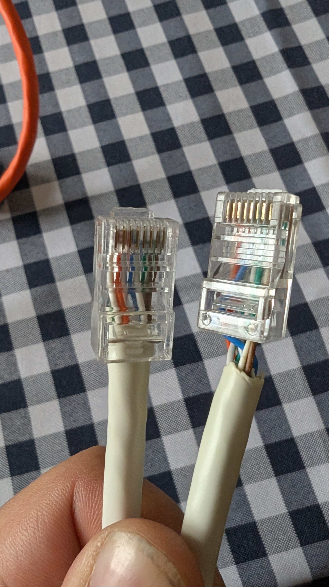
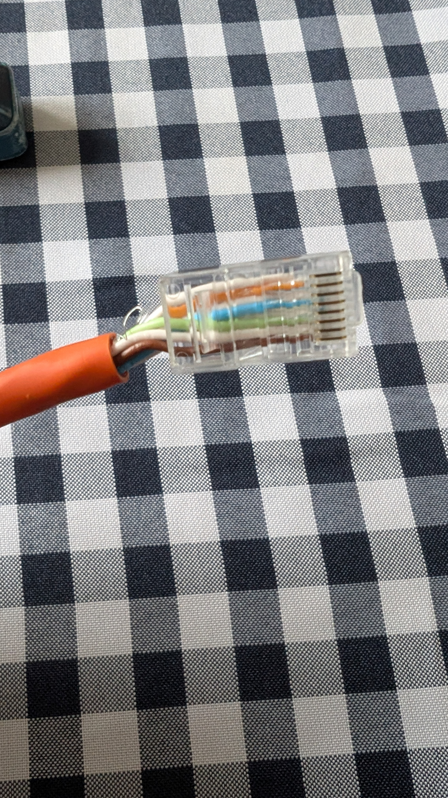
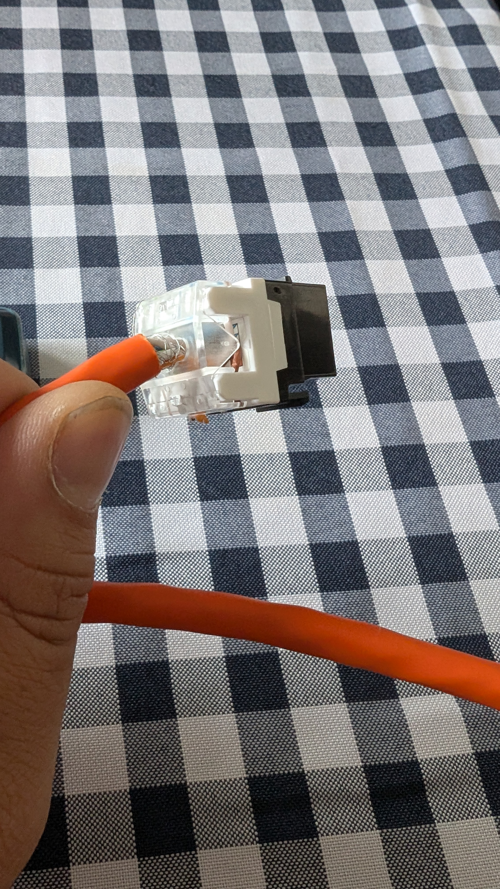

# Informe de Práctica: Fabricación y Comprobación de Cableado de Red

## 1. Descripción de la Tarea
El objetivo de esta práctica es la fabricación de dos latiguillos de red, aplicando correctamente el cableado según los estándares internacionales y verificando su funcionamiento mediante pruebas físicas y lógicas.

### Montajes realizados:
* **Cable 1:** Cable Cat 6 terminado en dos conectores macho RJ45.
* **Cable 2:** Cable de red terminado en un conector macho RJ45 y un conector hembra (Keystone) con terminación IDC.

---

## 2. Desarrollo de los Montajes

### Cable 1: RJ45 a RJ45 (CAT 6)
Para este cable se ha seleccionado el estándar **T568B**.

**Comentarios sobre el proceso:**
* **Dificultades:** El peinado y crimpado inicial fue complejo; el primer intento no quedó estético ni bien protegido (como se observa en la parte derecha de la imagen), por lo que se tuvo que repetir un extremo.
* **Resultado:** El segundo terminal quedó mucho más firme, con la funda correctamente insertada en el conector para mayor durabilidad.

### Cable 2: RJ45 a Keystone (CAT 7)
Se mantuvo el estándar **T568B** para asegurar la coherencia en la red. En este caso, se utilizó cable Cat 7.

**Comentarios sobre el proceso:**
* **El reto del Cat 7:** La dureza de los conductores y el uso de un conector no específico supusieron un gran desafío técnico. Lograr que los hilos llegaran al fondo del terminal requirió varios intentos de corte y crimpado.
* **El Keystone:** A diferencia del conector macho, el montaje de la hembra (Keystone) fue el proceso más fluido y satisfactorio de la práctica.

---

## 3. Comprobaciones y Resultados
Se realizaron las pruebas obligatorias para asegurar la calidad del latiguillo:

1.  **Comprobador de red:** Funcionamiento correcto (continuidad 1-8 en orden en ambos cables).
2.  **Prueba real (Ordenador):** Los cables transmiten datos correctamente y permiten la navegación.
3.  **Polímetro:** No se realizó por falta de tiempo en la sesión de prácticas.

---

## 4. Cuestiones Finales

* **¿Qué parte del montaje te resultó más difícil y por qué?**
    El crimpado del conector RJ45 sobre el cable Cat 7. La rigidez de los pares trenzados y el grosor del aislante dificultan mucho el peinado y la inserción total en el terminal.
* **¿Qué parte te resultó más fácil?**
    La inserción de los hilos en las ranuras del conector Keystone.
* **¿Qué fue lo más entretenido o divertido de la práctica?**
    El montaje del Keystone, ya que el sistema de inserción es muy limpio y el resultado es muy profesional.

---

## 5. Criterios de Realización
* **Estándar:** T568B aplicado rigurosamente.
* **Calidad:** Crimpado firme, conectores limpios y sin hilos expuestos fuera de la funda plástica.
